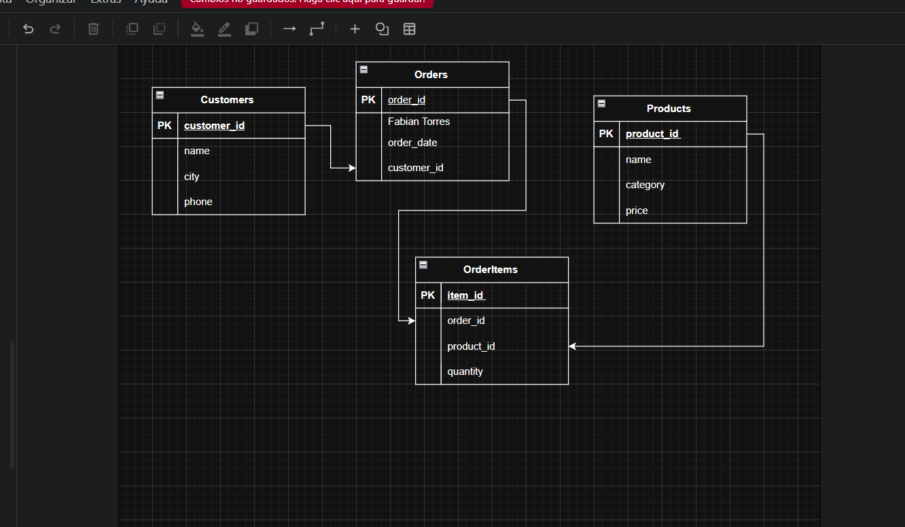

# Normaliza_tu_mundo_de_datos# Proyecto de Normalización de Bases de Datos

## Parte 1: Análisis conceptual – Devart
1.El problema principal que busca solucionar la normalizacion en una base de datos es limpiar la estructura para que todo funcione de forma
mas fluida e inteligente haciendola facil de manegar y gestionar los datos que contiene al descomponer en tablas mas pequeñas y conectadas, esto para darle un orden y agilizar todas las consultas necesarias ademas que al realizar la normalizacion se reduce que al realizar la normalizaion se reduce la probabilidad de errores.Es necesaria en todos los sistemas empresariales ya que nos ayudar notoriamente a hacer cualquier proceso que se desee realizar de manera mucho mas eficaz ademas de que ordenara todo de una manera satisfactoria.

2.Para mi las diferencias mas notorias es que el 1NF mas que todo es para hacer la revision de que ningun dato cree una dependencia parcial a otros atributos de clave no principal en los datos ya en el 2NF aplicaremos estos cambios que se necesitan para solucionar los errores que se generaron y se detectaron en el 1NF en el 3NF haremos algo parecido que los dos puntos anteriores ya que volveremos a analizar la base de datos para poder arreglar las dependencias transistivas que se crean al un atributo no principal depender de otro no principal.

3.En la seccion se parte la tabla de articulos de pedidos y se crea otra independiente llamada articulos este cambio podria afectar el rendimiento ya que al normalizar la tabla ooriginal en muchas tablas vinculadas por claves foraneas se incrementeran automaticamente el numero de ingresos necesarios para reconstruir una vista completa.

4.Las dependencias funcionales son aquellas que necesitamos identificar para la normalizacion y en base en estas realizar los cambios que necesitamos para dividir las tablas lo  mejor posible mejor dicho son relaciones entre atributos donde uno determina el valor de otro para identificarlas obviamente hay que analizar a fondo todas las partes de la base de datos los datos repetidos que encontremos reglas del negocio del cual dependa nuestro negocio.

5.En mis palabras desnormalizar es como guardar la misma información en más de un lugar a propósito, cuando hacerlo ayuda al negocio a trabajar más rápido o más simple, siempre y cuando tengas mecanismos para mantener los datos coherentes.

##  Parte 2: Caso Fred’s Furniture  

###  Reto 1 – Diagnóstico inicial
**Tabla original:** `forniture_sales`

Al analizar la tabla original, se detectaron varios problemas de **no normalización** y **redundancia de datos**.  
Esto genera las siguientes anomalías:

- **Anomalía de inserción:**  
  No se puede agregar un nuevo producto o cliente sin registrar una venta completa.  
  Por ejemplo, si un producto aún no se ha vendido, no puede existir en la tabla.

- **Anomalía de actualización:**  
  Si el nombre o la dirección de un cliente cambia, hay que actualizar todas las filas donde aparece.  
  Esto aumenta el riesgo de inconsistencias.

- **Anomalía de eliminación:**  
  Si se elimina una venta, también se pierde toda la información del cliente o del producto asociado.

 **Causa:**  
Todos los datos (clientes, pedidos y productos) están almacenados en una sola tabla, con valores repetidos y dependencias innecesarias.

---

###  Reto 2 – Aplicación de Primera Forma Normal (1FN)

**Objetivo:** Asegurar que todos los campos sean **atómicos**, es decir, que cada celda contenga un solo valor y no listas o conjuntos de datos.

**Problema detectado:**  
Campos como `product_list` o `customer_info` contenían múltiples valores en una sola celda.

**Solución:**  
Separar los valores multivaluados y asignarles una fila por producto o cliente.

**Ejemplo de estructura corregida:**
```sql
CREATE TABLE Sales (
  sale_id INT PRIMARY KEY,
  sale_date DATE,
  customer_name VARCHAR(100),
  product_name VARCHAR(100),
  quantity INT,
  price DECIMAL(10,2)
);
```

 **Resultado:**  
Cada columna contiene datos simples y atómicos. La tabla cumple con la **1NF**.

---

###  Reto 3 – Aplicación de Segunda Forma Normal (2NF)

**Objetivo:** Eliminar las **dependencias parciales**, es decir, que los atributos dependan completamente de la clave primaria.

**Problema detectado:**  
En la tabla anterior, algunos campos dependían parcialmente de la clave compuesta (`sale_id`, `product_name`).  
Por ejemplo:
- `product_name` y `price` dependen solo del producto.
- `customer_name` depende solo del cliente.

**Solución:**  
Dividir la tabla en entidades separadas que representen **Clientes**, **Pedidos** y **Productos**.

**Nuevas tablas:**
```sql
CREATE TABLE Customers (
  customer_id INT PRIMARY KEY AUTO_INCREMENT,
  name VARCHAR(100),
  city VARCHAR(100),
  phone VARCHAR(50)
);

CREATE TABLE Products (
  product_id INT PRIMARY KEY AUTO_INCREMENT,
  name VARCHAR(100),
  category VARCHAR(100),
  price DECIMAL(10,2)
);

CREATE TABLE Orders (
  order_id INT PRIMARY KEY AUTO_INCREMENT,
  order_date DATE,
  customer_id INT,
  FOREIGN KEY (customer_id) REFERENCES Customers(customer_id)
);
```

 **Resultado:**  
Cada atributo depende completamente de su clave primaria → **Cumple con la 2NF**.

---

###  Reto 4 – Aplicación de Tercera Forma Normal (3NF)

**Objetivo:** Eliminar **dependencias transitivas**, es decir, cuando un atributo no clave depende de otro atributo no clave.

**Problema detectado:**  
Por ejemplo, `customer_city` depende de `customer_id` (no directamente del pedido).

**Solución:**  
Mover estos atributos a las tablas correspondientes y crear una tabla intermedia para los productos vendidos en cada pedido.

**Estructura final:**
```sql
CREATE TABLE OrderItems (
  item_id INT PRIMARY KEY AUTO_INCREMENT,
  order_id INT,
  product_id INT,
  quantity INT,
  FOREIGN KEY (order_id) REFERENCES Orders(order_id),
  FOREIGN KEY (product_id) REFERENCES Products(product_id)
);
```

 **Resultado:**  
Las dependencias transitivas fueron eliminadas, y los datos están totalmente normalizados hasta la **3FN**.

---

###  Modelo E-R Final



---

###  Reglas de negocio

1. Cada pedido pertenece a un único cliente.  
2. Un cliente puede tener varios pedidos registrados.  
3. Un pedido puede incluir varios productos.  
4. Un producto puede estar en varios pedidos.  
5. Los precios de los productos se gestionan solo desde la tabla `Products`.  
6. No se puede eliminar un cliente que tenga pedidos activos.  

---

###  Justificación del diseño

- **1FN:** Todos los datos son atómicos.  
- **2NF:** No existen dependencias parciales; cada campo depende de la clave completa.  
- **3NF:** No hay dependencias transitivas; cada dato depende directamente de la clave primaria de su tabla.  
- **Integridad referencial:** Todas las relaciones entre tablas se establecen mediante claves foráneas (`FOREIGN KEY`).  
- **Beneficio:** Se evita la duplicación de información, se mejora la coherencia y la base se vuelve más escalable.  

Aunque la normalización implica más uniones (`JOIN`), el beneficio en organización, integridad y mantenimiento es mucho mayor.  

**Resultado final:**  
La base de datos Fred’s Furniture está completamente normalizada hasta la **Tercera Forma Normal (3FN)**, con las entidades `Customers`, `Orders`, `Products` y `OrderItems` correctamente relacionadas.

## Parte 3: Proyecto personal

###  Título y descripción
**Proyecto:** Gestión de entregas y domicilios de una tienda virtual  

Este proyecto modela la estructura de una tienda en línea que gestiona pedidos, entregas y pagos.  
Incluye clientes con múltiples direcciones, productos con categorías, pedidos con sus ítems, pagos asociados y un sistema de seguimiento de entregas a cargo de repartidores (couriers).  

El diseño está **normalizado hasta la 3FN**, garantizando integridad referencial y evitando redundancia de datos.  

---

###  Diagrama E-R


---

###  Reglas de negocio y justificación

**Reglas de negocio:**
1. Un cliente puede registrar varias direcciones, pero una de ellas debe marcarse como principal (`is_default = TRUE`).
2. Cada pedido debe tener al menos un producto en `OrderItems`.
3. No se puede eliminar un cliente que tenga pedidos asociados.
4. Los pedidos solo pueden tener una entrega activa en estado `PENDING` o `IN_TRANSIT`.
5. Los repartidores (`Couriers`) solo pueden tomar entregas si están activos.
6. El costo total del pedido se calcula como:  
   `total_amount = subtotal + shipping_fee`
7. El historial de entrega (`DeliveryStatusHistory`) registra cada cambio de estado con marca de tiempo.

**Justificación del diseño:**
- **1NF:** Todos los atributos son atómicos; no existen listas ni campos multivalorados.
- **2NF:** Los atributos no clave dependen totalmente de la clave primaria.
- **3NF:** No existen dependencias transitivas; todos los datos dependen solo de su clave.
- **Integridad referencial:** Cada tabla se vincula mediante claves foráneas con `ON DELETE CASCADE` donde aplica.
- **Escalabilidad:** El modelo soporta nuevos métodos de pago, zonas adicionales y múltiples repartidores sin duplicar información.
- **Mantenimiento:** La separación entre pedidos, entregas y productos facilita auditoría, reportes y futuras integraciones con APIs externas.

 **Resultado:**  
La base de datos está completamente normalizada, lista para implementarse en MySQL/MariaDB y optimizada para consultas empresariales de gestión de pedidos y domicilios.
